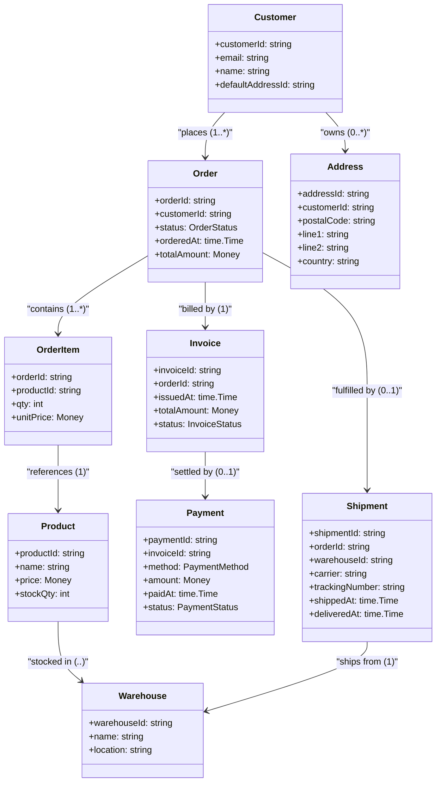
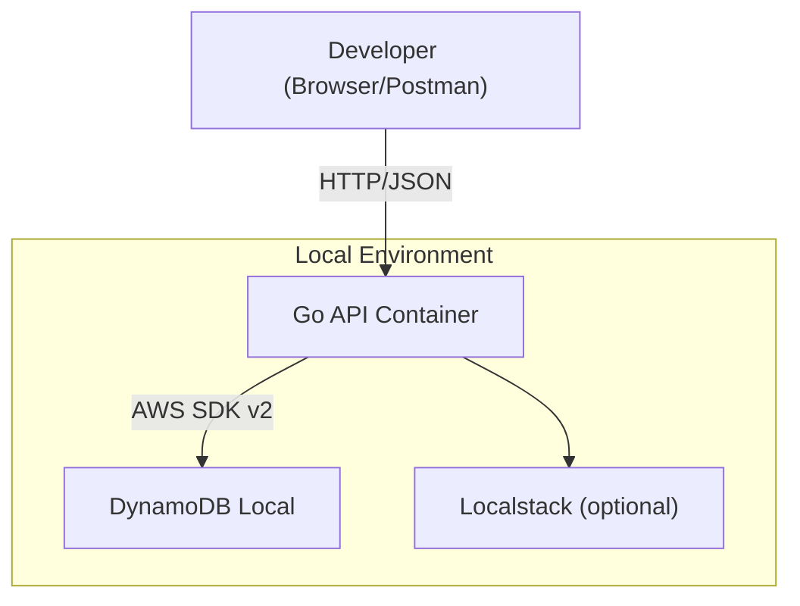

# design.md

## 1. ドメインモデル

---

## 2. API 設計

### 仕様ファイル

- **api/openapi.yml** — OpenAPI 3.1 を唯一の真実の API 仕様とするのだ。

### 主要エンドポイント

| Method | Path                                  | 説明              |
| ------ | ------------------------------------- | --------------- |
| GET    | /products                             | 商品一覧を取得するのだ。    |
| GET    | /products/{productId}                 | 単一商品を取得するのだ。    |
| POST   | /carts/{customerId}/items             | カートに商品を追加するのだ。  |
| DELETE | /carts/{customerId}/items/{productId} | カートから商品を削除するのだ。 |
| POST   | /orders                               | カートを注文に確定するのだ。  |
| GET    | /orders/{orderId}                     | 注文詳細を取得するのだ。    |
| GET    | /customers/{customerId}/orders        | 顧客の注文履歴を取得するのだ。 |
| POST   | /payments                             | 決済を実行するのだ。      |
| POST   | /shipments                            | 発送情報を登録するのだ。    |

---

## 3. DB 設計（DynamoDB シングルテーブル）

### テーブル定義

| 属性     | 用途                        | 例                                                    |
| ------ | ------------------------- | ---------------------------------------------------- |
| **PK** | パーティションキー:`<ENTITY>#<ID>` | `CUSTOMER#123`, `ORDER#abc`                          |
| **SK** | ソートキー:エンティティやリレーション識別     | `METADATA`, `ORDER#20250614T030000Z`, `ITEM#sku-999` |
| その他属性  | ドメイン属性 + 型                | `name:string`, `price:number`, `status:string` など    |

### アイテムタイプと PK/SK パターン

| Entity                       | PK                        | SK                      | 備考         |
| ---------------------------- | ------------------------- | ----------------------- | ---------- |
| Customer                     | `CUSTOMER#<CustomerId>`   | `METADATA`              | 顧客メタデータ    |
| Address                      | `CUSTOMER#<CustomerId>`   | `ADDRESS#<AddressId>`   | 顧客の住所      |
| Product                      | `PRODUCT#<ProductId>`     | `METADATA`              | 商品メタデータ    |
| Warehouse                    | `WAREHOUSE#<WarehouseId>` | `METADATA`              | 倉庫メタデータ    |
| Stock (product in warehouse) | `WAREHOUSE#<WarehouseId>` | `PRODUCT#<ProductId>`   | 在庫数量を属性に保持 |
| Order (header)               | `ORDER#<OrderId>`         | `METADATA`              | 注文ヘッダ      |
| OrderItem                    | `ORDER#<OrderId>`         | `ITEM#<ProductId>`      | 注文の明細      |
| Invoice                      | `ORDER#<OrderId>`         | `INVOICE#<InvoiceId>`   | 請求書        |
| Payment                      | `ORDER#<OrderId>`         | `PAYMENT#<PaymentId>`   | 決済情報       |
| Shipment                     | `ORDER#<OrderId>`         | `SHIPMENT#<ShipmentId>` | 物流情報       |

#### 代表的な GSI

| GSI 名 | PK                                                                      | SK                                    | ユースケース               |
| ----- | ----------------------------------------------------------------------- | ------------------------------------- | -------------------- |
| GSI1  | `PRODUCT#<ProductId>` / `INVOICE#<InvoiceId>` / `SHIPMENT#<ShipmentId>` | `<date>` または `<ID>`                   | 商品別注文履歴、請求詳細、出荷詳細    |
| GSI2  | `WAREHOUSE#<WarehouseId>` / `CUSTOMER#<CustomerId>`                     | begins\_with prefix または between dates | 倉庫別出荷/在庫、顧客別請求/注文/活動 |

---

## 4. 技術アーキテクチャ

### 構成概要

- **Go API コンテナ**: Echo + oapi-codegen 生成ハンドラで実装。環境変数で DynamoDB エンドポイントを `http://dynamodb-local:8000` に向けるのだ。
- **DynamoDB Local**: Amazon 提供の JAR を Docker で起動。永続化ボリュームをマウントしてテーブル定義を保持するのだ。
- **Localstack (任意)**: 将来的に SQS/SNS などの統合テストが必要になった場合に追加するのだ。
- **ネットワーク**: Docker Compose の default bridge 上に各サービスを配置。`dynamodb-local` サービスはポート 8000 をエクスポーズするのだ。

### 依存バージョン

| Component         | Version |
| ----------------- | ------- |
| Go                | 1.22    |
| AWS SDK for Go v2 | ^2.0.0  |
| DynamoDB Local    | 2.4.0   |
| oapi-codegen      | latest  |
| Docker Compose    | 2.x     |

---

