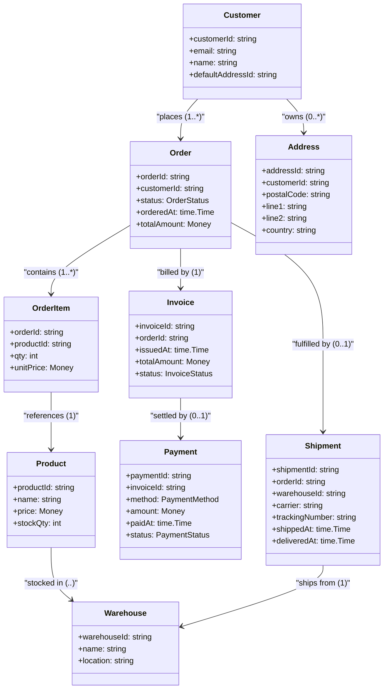
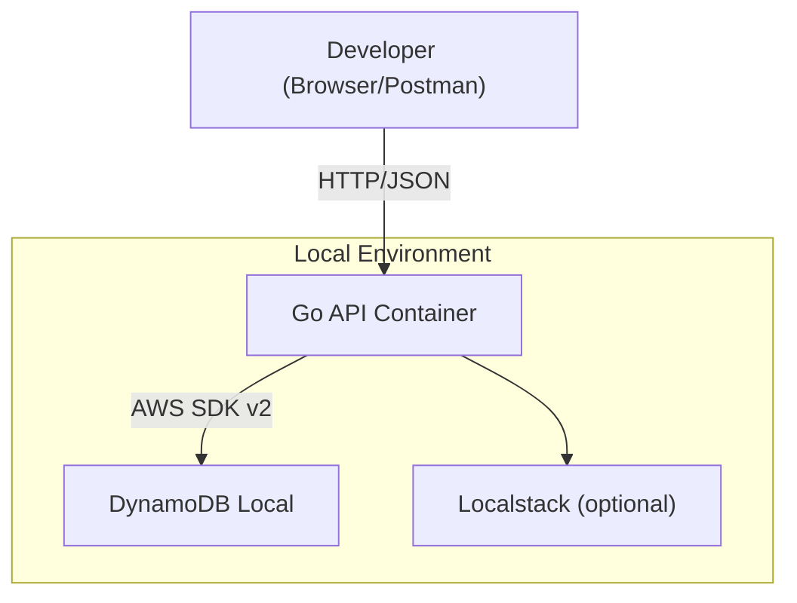

# design.md

## 1. ドメインモデル



---

## 2. API 設計

### 仕様ファイル

- **api/openapi.yml** — OpenAPI 3.1 を唯一の真実の API 仕様とするのだ。

### 主要エンドポイント

| Method | Path                                  | 説明                           |
| ------ | ------------------------------------- | ------------------------------ |
| GET    | /products                             | 商品一覧を取得するのだ。       |
| GET    | /products/{productId}                 | 単一商品を取得するのだ。       |
| POST   | /carts/{customerId}/items             | カートに商品を追加するのだ。   |
| DELETE | /carts/{customerId}/items/{productId} | カートから商品を削除するのだ。 |
| POST   | /orders                               | カートを注文に確定するのだ。   |
| GET    | /orders/{orderId}                     | 注文詳細を取得するのだ。       |
| GET    | /customers/{customerId}/orders        | 顧客の注文履歴を取得するのだ。 |
| POST   | /payments                             | 決済を実行するのだ。           |
| POST   | /shipments                            | 発送情報を登録するのだ。       |

---

## 3. DB 設計（DynamoDB シングルテーブル）

### 🎯 **シングルテーブル設計を採用する根拠**

DynamoDB ではリレーショナルデータベースとは異なり、**シングルテーブル設計**が推奨されるのだ。この設計には以下の明確な根拠があるのだ。

#### **1. パフォーマンスと効率性**

**🚀 低レイテンシーの実現**

```
従来のRDB: 複数テーブルのJOIN → 複数回のディスクアクセス
DynamoDB:   1回のQuery → 1回のアクセスで関連データ全取得
```

**具体例**: 注文詳細画面

- **RDB**: Orders + OrderItems + Products + Customer → 4 回のクエリ
- **DynamoDB**: `PK=ORDER#123` → 1 回のクエリで全情報取得

#### **2. コスト効率**

**💰 Request Unit (RU) の最適化**

- **複数テーブル**: 関連データ取得に複数回の Read RU 消費
- **シングルテーブル**: 1 回の Query で必要データ一括取得
- **GSI 使用**: メインテーブル + GSI で異なるアクセスパターンに対応

#### **3. DynamoDB の特性に最適化**

**⚡ NoSQL の強みを活用**

- **水平スケーリング**: パーティション分散が効率的
- **プロビジョニング**: 1 つのテーブルのキャパシティ管理
- **一貫性**: 同一パーティション内での強一貫性

#### **4. アクセスパターンベース設計**

**📊 クエリパターンの事前定義**

```
RDB:  正規化 → 後からクエリ最適化
NoSQL: アクセスパターン定義 → テーブル構造決定
```

**このプロジェクトのアクセスパターン**:

1. 顧客情報取得: `PK=CUSTOMER#123, SK=CUSTOMER#123`
2. 注文詳細取得: `PK=ORDER#456` (注文+明細+請求書を一括)
3. 顧客注文履歴: `GSI1: PK=CUSTOMER#123, SK=ORDER#*`
4. 商品別注文履歴: `GSI1: PK=PRODUCT#789, SK=date_range`

#### **5. 運用面のメリット**

**🔧 管理の簡素化**

- **バックアップ**: 1 つのテーブルの管理
- **監視**: 1 つのテーブルのメトリクス監視
- **スケーリング**: 統一されたキャパシティ管理

### **📋 現在の実装 vs 理論上のフル実装**

| 要素                 | 現在の MVP               | 理論上のフル実装                        |
| -------------------- | ------------------------ | --------------------------------------- |
| **Entity 数**        | Customer, Product, Order | + Invoice, Payment, Shipment, Warehouse |
| **GSI 使用**         | GSI1 のみ                | GSI1 + GSI2                             |
| **アクセスパターン** | 基本 CRUD + 顧客注文履歴 | 全 16 パターン対応                      |
| **Item 分割**        | 1 entity = 1 item        | Customer→metadata+address 分割          |

### テーブル定義

| 属性       | 用途                                      | 例                                                   |
| ---------- | ----------------------------------------- | ---------------------------------------------------- |
| **PK**     | パーティションキー:`<ENTITY>#<ID>`        | `CUSTOMER#123`, `ORDER#abc`                          |
| **SK**     | ソートキー:エンティティやリレーション識別 | `METADATA`, `ORDER#20250614T030000Z`, `ITEM#sku-999` |
| その他属性 | ドメイン属性 + 型                         | `name:string`, `price:number`, `status:string` など  |

### アイテムタイプと PK/SK パターン

| Entity                       | PK                        | SK                        | 備考                   |
| ---------------------------- | ------------------------- | ------------------------- | ---------------------- |
| Customer                     | `CUSTOMER#<CustomerId>`   | `CUSTOMER#<CustomerId>`   | 顧客基本情報（MVP）    |
| Address                      | `CUSTOMER#<CustomerId>`   | `ADDRESS#<AddressId>`     | 顧客の住所（拡張）     |
| Product                      | `PRODUCT#<ProductId>`     | `PRODUCT#<ProductId>`     | 商品基本情報（MVP）    |
| Warehouse                    | `WAREHOUSE#<WarehouseId>` | `WAREHOUSE#<WarehouseId>` | 倉庫メタデータ（拡張） |
| Stock (product in warehouse) | `WAREHOUSE#<WarehouseId>` | `PRODUCT#<ProductId>`     | 在庫数量（拡張）       |
| Order (header)               | `ORDER#<OrderId>`         | `ORDER#<OrderId>`         | 注文ヘッダ（MVP）      |
| OrderItem                    | `ORDER#<OrderId>`         | `ITEM#<ProductId>`        | 注文の明細（MVP）      |
| Invoice                      | `ORDER#<OrderId>`         | `INVOICE#<InvoiceId>`     | 請求書（拡張）         |
| Payment                      | `ORDER#<OrderId>`         | `PAYMENT#<PaymentId>`     | 決済情報（拡張）       |
| Shipment                     | `ORDER#<OrderId>`         | `SHIPMENT#<ShipmentId>`   | 物流情報（拡張）       |

### 🎯 **現在の GSI1 設計**

| Entity       | GSI1PK                  | GSI1SK                   | 用途               | 実装状況    |
| ------------ | ----------------------- | ------------------------ | ------------------ | ----------- |
| **Customer** | `EMAIL#{email}`         | `CUSTOMER#{id}`          | メールアドレス検索 | ✅ 実装済み |
| **Product**  | `PRODUCT#ALL`           | `PRODUCT#{id}`           | 商品一覧取得       | ✅ 実装済み |
| **Order**    | `CUSTOMER#{customerID}` | `ORDER#{createdAt}#{id}` | 顧客別注文履歴     | ✅ 実装済み |

#### 理論上の GSI 設計（フル実装）

| GSI 名 | PK                                                                      | SK                                      | ユースケース                          |
| ------ | ----------------------------------------------------------------------- | --------------------------------------- | ------------------------------------- |
| GSI1   | `PRODUCT#<ProductId>` / `INVOICE#<InvoiceId>` / `SHIPMENT#<ShipmentId>` | `<date>` または `<ID>`                  | 商品別注文履歴、請求詳細、出荷詳細    |
| GSI2   | `WAREHOUSE#<WarehouseId>` / `CUSTOMER#<CustomerId>`                     | begins_with prefix または between dates | 倉庫別出荷/在庫、顧客別請求/注文/活動 |

---

## 4. 技術アーキテクチャ



### 構成概要

- **Go API コンテナ**: Echo + oapi-codegen 生成ハンドラで実装。環境変数で DynamoDB エンドポイントを `http://dynamodb-local:8000` に向けるのだ。
- **DynamoDB Local**: Amazon 提供の JAR を Docker で起動。永続化ボリュームをマウントしてテーブル定義を保持するのだ。
- **Localstack (任意)**: 将来的に SQS/SNS などの統合テストが必要になった場合に追加するのだ。
- **ネットワーク**: Docker Compose の default bridge 上に各サービスを配置。`dynamodb-local` サービスはポート 8000 をエクスポーズするのだ。

### 依存バージョン

| Component         | Version |
| ----------------- | ------- |
| Go                | 1.22    |
| AWS SDK for Go v2 | ^2.0.0  |
| DynamoDB Local    | 2.4.0   |
| oapi-codegen      | latest  |
| Docker Compose    | 2.x     |

---
